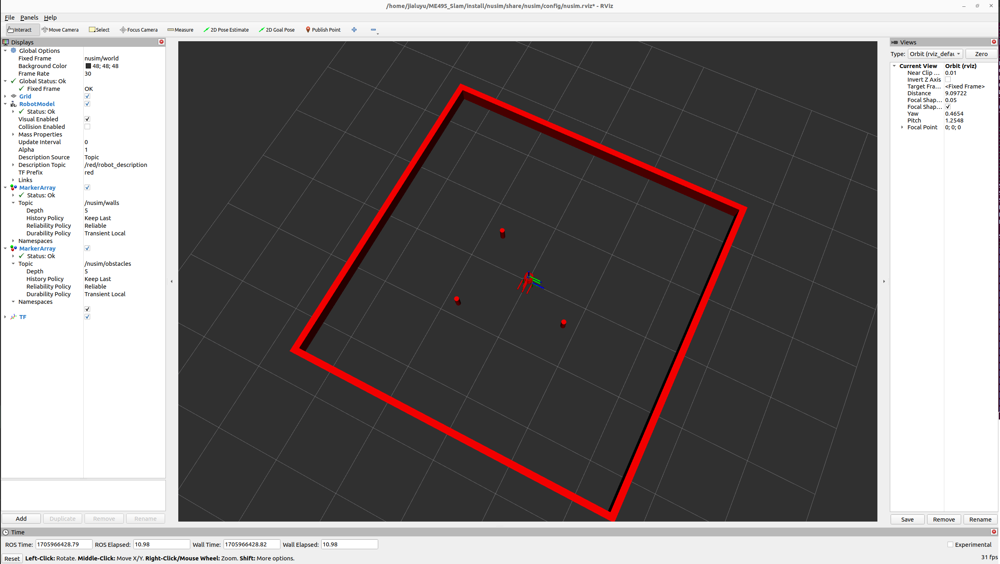

# Nusim Package

## Description
The Nusim package is a comprehensive simulation for a single red turtlebot in the user-customized arena with obstacles.

## Launch Files
Nusim includes several launch files to simplify the simulation setup. The file name is launch/nusim.launch.xml and you could launch it by typing

```
$ ros2 launch nusim nusim.launch.xml
```

## Simulator Parameters
The Nusim simulator can be configured through parameters set in the `basic_world.yaml` file. This configuration file allows users to customize various aspects of the simulation environment. Key parameters include:

- **rate**: The rate at which the simulator operates (default: 200 Hz).
- **x0, y0, theta0**: Initial position (x0, y0) and orientation (theta0) of the simulation entity.
- **obstacles/x, obstacles/y**: Coordinates of obstacles in the simulation environment.
- **obstacles/r**: Radius of the obstacles in the simulation environment.
- **arena_x_length, arena_y_length**: Dimensions of the simulation arena.

Modify `basic_world.yaml` as needed to fit your simulation requirements.

## Rviz Screenshot
Below is a screenshot from Rviz as launched using the `nusim.launch` file:



This screenshot should illustrate the simulation environment as configured by the `basic_world.yaml` file, including the positioning of obstacles and arena dimensions.

