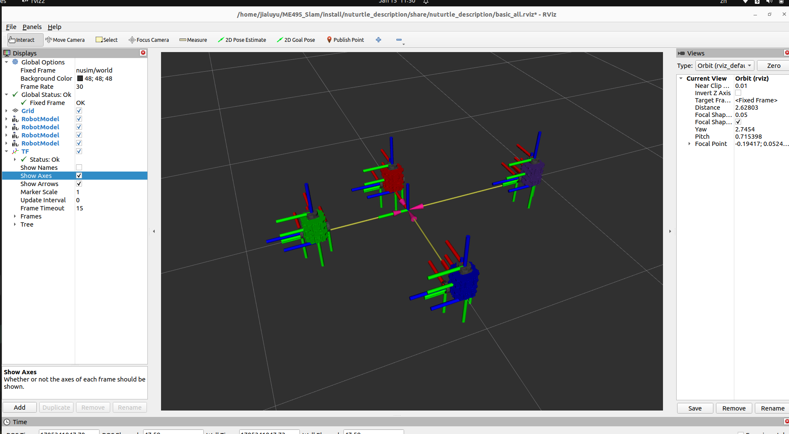

# Nuturtle  Description
URDF files for Nuturtle *turtlebot3_burger.urdf.xacro*
* `ros2 launch nuturtle_description load_^Ce.launch.py color:=blue` to see the robot in rviz. You can change `blue` into `green`, `purple`, `red` and the default is `blue`.
* `ros2 launch nuturtle_description load_all.launch.xml` to see four copies of the robot in rviz.

* The rqt_graph when all four robots are visualized (Nodes Only, Hide Debug) is:

# Launch File Details
* ` ros2 launch nuturtle_description load_one.launch.py --show-args`
  ```
    Arguments (pass arguments as '<name>:=<value>'):

    'use_jsp':
        use_jsp: if true, then joint state publisher is used to publish joint states
        (default: 'true')

    'use_rviz':
        control whether rviz is launched
        (default: 'true')

    'color':
        the color of the baselink. Valid choices are: ['purple', 'red', 'green', 'blue']
        (default: 'purple')

    'x':
        the x of robot
        (default: '0')

    'y':
        the y of robot
        (default: '0')```
* `ros2 launch nuturtle_description load_all.launch.xml --show-args`
```
    Arguments (pass arguments as '<name>:=<value>'):

    'use_jsp':
        use_jsp: if true, then joint state publisher is used to publish joint states
        (default: 'true')

    'use_rviz':
        control whether rviz is launched
        (default: 'true')

    'color':
        the color of the baselink. Valid choices are: ['purple', 'red', 'green', 'blue']
        (default: 'purple')

    'x':
        the x of robot
        (default: '0')

    'y':
        the y of robot
        (default: '0')
`
  `<Output of the Above Command>`git p``